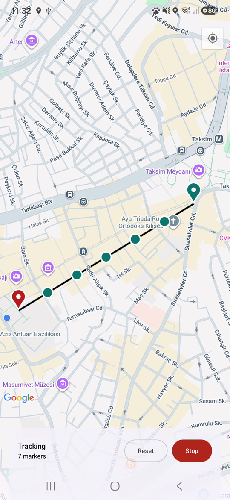
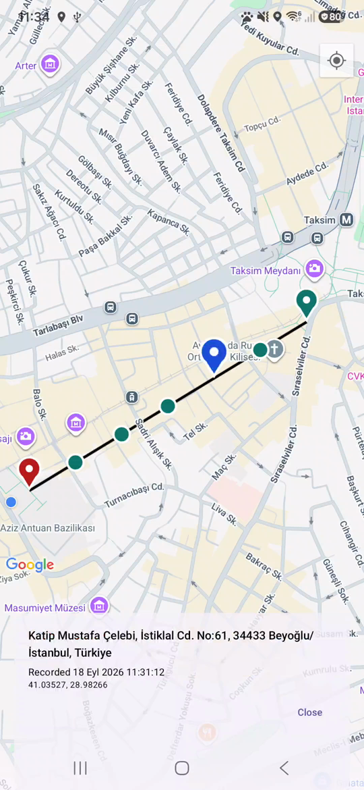
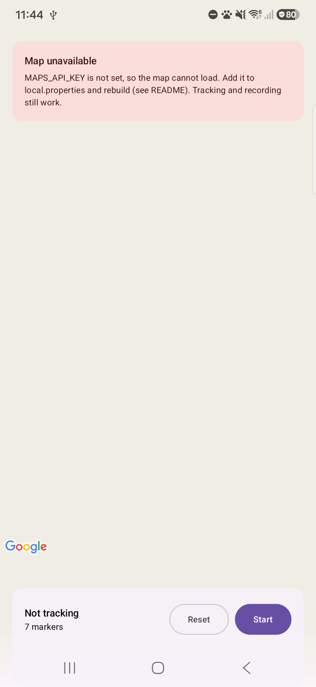

# Route Tracker

An Android app that tracks the user's location in the foreground and background and adds a map marker
each time the user has moved 100 m from the last marker. Tapping a marker shows its address. Tracking can
be started and stopped, and the route stays on the map across app restarts until it is reset. Kotlin,
Jetpack Compose, Google Maps, Room, DataStore, Koin, and a location foreground service.

Every design decision, the alternative it beat, and how it was verified is in
[`docs/decisions.md`](docs/decisions.md). The numbers below cite those entries as D1–D22.

## Demo

Recorded on an emulator with a scripted route: a made-up 707 m route along İstiklal Caddesi, Istanbul, from
Taksim to Galatasaray. The location is sent once a second with `adb emu geo fix`, at about 11 m per second.
Both clips play in real time; they were captured with the emulator's own recorder on an API 36 emulator.

- [Clip 1: fresh install, precise location, start, walk, background, notification, return](docs/media/clip1-tracking.mp4) (105 s)
- [Clip 2: address on tap, stop, swipe away from recents, reopen, reset](docs/media/clip2-address-stop-reset.mp4) (38 s)

Clip 1 stops moving for a few seconds before the app goes to the background, and the notification shade stays
open while the route continues in the background. In an earlier take, the first location delivery after that
switch arrived 18 s late and the next marker landed 196 m after the previous one (verification log, "Demo
re-recorded").

| Route, with markers recorded in the background | Notification while in the background | Address of a tapped marker |
|---|---|---|
|  |  |  |

In clip 1 the markers are 110, 110, 110, 143, 110 and 110 m apart. The last three were recorded while the app was
in the background, and the notification's marker count rises from 4 to 7 (verification log, "Demo re-recorded").

## Requirements and where they are implemented

| Requirement | Implementation | Decisions |
|---|---|---|
| A marker for every 100 m of movement | `DistanceGate` and `RecordFixUseCase` in `:core`; anchor query `RouteDao.last()` | D10–D14 |
| Track in the foreground and in the background, for as long as possible | `TrackingService`, a location foreground service | D17, D19 |
| Tapping a marker shows its address | Details card in `TrackingScreen`; `RoomAddressLookup`, `GeocoderAddressResolver` | D21, D14 |
| Start and stop tracking | `TrackingViewModel` → `ServiceTrackingController` → `TrackingService`; permission flow | D16–D18 |
| Reset the route | Confirmation dialog → `RouteRepository.reset()` | D15, D22 |
| The route is shown again when the app is reopened, until reset | Room table `route_points`, observed by `TrackingViewModel` | D9, D10 |

## Setup

**Tooling used for this project:** Android Studio 2026.1 (build AI-261.26222.65.2614.16204760), Android SDK
platform 37, Gradle 9.6.0 through the wrapper, AGP 9.4.0, Kotlin 2.4.20. `minSdk` is 26 and `targetSdk` 37.

**JDK:** `gradle/gradle-daemon-jvm.properties` asks for a JDK 25 to run the Gradle daemon. In a fresh clone
on the author's machine, Gradle found the installed JDK 25.0.1 and used it. On a machine without JDK 25,
Gradle can download one from the URLs in that file; that path was not tested here.

### Google Maps API key

The key is not in the repository. To see the map, create your own:

1. In the Google Cloud console, enable **Maps SDK for Android** and create an API key.
2. Restrict it to Android apps, with package name `com.erolgizlice.routetracker` and **your own** debug
   SHA-1. Restrict its APIs to Maps SDK for Android. Get the SHA-1 with:

   ```bash
   keytool -list -v -keystore ~/.android/debug.keystore -alias androiddebugkey -storepass android -keypass android
   ```

3. Add it to `local.properties` (git-ignored) and rebuild:

   ```properties
   MAPS_API_KEY=your-key
   ```

   A `MAPS_API_KEY` environment variable works too. Changing the key invalidates Gradle's configuration
   cache, so the next build picks it up (D4).

Because the key is tied to a debug signing certificate, use a debug build from the machine whose SHA-1 you
registered.

**Without a key**, the build still succeeds, tracking and recording still work, and the map area shows an
explanation instead of a blank map (D5):



## Build and test

```bash
./gradlew assembleDebug
./gradlew :core:test                                                   # 25 JVM tests: the 100 m rule
ANDROID_SERIAL=<device-serial> ./gradlew :data:connectedDebugAndroidTest   # 6 instrumented tests: Room SQL
adb -s <device-serial> install -r app/build/outputs/apk/debug/app-debug.apk
```

On 2026-09-17 all 31 tests passed from freshly generated results (25 JVM, 6 on an API 33 emulator).
Connected tests run on every attached device unless `ANDROID_SERIAL` names one. To move an emulator, use
`adb emu geo fix <longitude> <latitude>` (longitude first).

## Architecture

```
:app ──► :feature:tracking ──► :core
  └────► :data ───────────────► :core
```

- **`:core`** is pure Kotlin/JVM: the domain model, the 100 m rule, `RecordFixUseCase`, and the contracts the
  UI needs. Any Android import there is a compile error (D6).
- **`:data`**: Room for the route, DataStore for the "session active" flag, the foreground service with the
  fused location provider, notifications, the Geocoder, and the Koin module.
- **`:feature:tracking`**: the Compose map screen and `TrackingViewModel`. It depends on `:core` only.
- **`:app`**: `Application` (starts Koin, so a restarted service has its dependencies, D8), `MainActivity`,
  and the API key wiring.

**MVI:** the screen renders one `StateFlow<TrackingState>` and sends every action through
`onIntent(TrackingIntent)`. One-off actions, like the permission request, travel as effects (D7).

**Room and DataStore:** the route is a list with queries, so it goes in Room, in insertion order (D9). The
session is a single flag, so it goes in DataStore. A sticky restart reads it, because its `Intent` is null.

**Foreground service:** started with `startService` from the foreground app, then promoted with a
location-typed `startForeground`. The order is permission check → `startForeground` → location updates, and
a refusal is caught and ends the session cleanly (D17).

## The 100 m rule

- **The anchor is the last recorded point, not the last GPS fix.** Measuring fix to fix would let GPS jitter
  add markers while standing still, and a slow walk would never add one. The anchor is the newest row in
  Room, so the rule survives process death (D10).
- **Fixes with no accuracy, or accuracy worse than 50 m, are rejected** before the anchor is considered. On a
  Samsung Galaxy S23, the first fix after starting had an accuracy of 100 m and would otherwise have become
  the start of the route. 50 m is a judgment, not a tuned value (D12).
- **Distance is haversine on a spherical Earth,** which keeps the rule testable on the JVM. The difference
  from the WGS84 ellipsoid is at most about 0.5% (D13).
- **One writer:** read anchor → evaluate → write runs under a mutex in the single `RecordFixUseCase`, so
  batched fixes cannot both pass against the same anchor (D14).
- The location request is high accuracy, every 10 s, at most every 5 s, with no platform distance filter (D19).

## Background behaviour, as measured

| Scenario | Result | Device | Ref |
|---|---|---|---|
| Start tracking | Foreground service with type location | Samsung Galaxy S23, Android 16 | D17 |
| HOME, 45 s in the background | Fixes kept arriving; the platform recorded location access through the foreground service, with only while-in-use permission | Samsung Galaxy S23, Android 16 | D17 |
| Process killed by the system, 4 times | The service restarted within 1–16 s each time, regained foreground location, and tracking continued | Samsung Galaxy S23, Android 16 | D17, D8 |
| Location permission revoked while tracking | The service restarted after the platform's 64 s backoff and ended the session 0.4 s later, without a crash, posting "Tracking stopped" | Samsung Galaxy S23, Android 16 | D17 |
| Force-stop while tracking | No restart within 30 s. On reopening, the app said tracking had stopped, and the route was kept | Samsung Galaxy S23, Android 16 | D17 |
| Stop from the notification | Session ended; no "Tracking stopped" notification | Samsung Galaxy S23, Android 16 | D17 |
| 4 rotations while tracking | Same process, no new start command, marker count unchanged | API 33 emulator | D17 |
| Task swiped away from recents | Tracking continued and the next point was recorded | API 33 emulator | D17 |
| Offline while opening an address | "Address unavailable" with Retry; the address appeared after reconnecting | API 33 emulator | D21 |

## Known limitations

- **After a force-stop or a reboot, tracking does not start again by itself.** The route is kept, and the app
  says tracking stopped. This is deliberate: location tracking restarts only when the user asks (D17).
- **Not tested:** Doze and long periods in the background, OEM battery management, swiping away on OEM
  launchers (measured on stock Android only), and Android 8–12 (API 26–32). Tested devices: a Samsung
  Galaxy S23 with Android 16, and an API 33 emulator.
- **A refused service restart** was seen in another app on the same device model but never triggered here.
  The path is implemented (the session ends with a notification) and unverified in this project (D17).
- **Stop and Start continue the same route.** Distance covered while stopped is joined by a straight line
  (D22).
- **Inaccurate fixes are dropped on purpose,** so indoors or in tunnels markers can be delayed and a route
  can have gaps (D12).
- **Addresses depend on the platform Geocoder and the network.** Offline, a marker shows no address until a
  retry succeeds (D21).
- **Fixes still queued when a session ends are dropped.** A fix already being recorded at that moment still
  completes, so at most one point can land milliseconds after Stop (D17).
- **`ACCESS_BACKGROUND_LOCATION` is not requested.** A location foreground service started from the
  foreground keeps receiving location in the background with while-in-use permission. The measurements in
  D17 show exactly that, and it avoids the separate background-location permission flow.
- The emulator's map renderer, from older Google Play services, needs the Apache HTTP legacy library, which
  is declared (D20).

## AI usage

This project was built with **Claude Code**, using the model **Claude Opus 5**. Every commit carries a
`Co-Authored-By: Claude Opus 5` trailer.

**Workflow:** prompt → plan → implementation → verification with the repository's skills
(`.claude/skills/verify-claim` for builds, tests and mutation checks; `.claude/skills/device-check` for
devices and emulators) → commit. At each milestone, a second, independent Claude Code session re-measured the
claims (test counts, mutations, on-device behaviour), and its findings were fixed in follow-up commits.
Attempts that turned out to be invalid are kept in the verification log of `docs/decisions.md`.

**What the author did:** answered the assistant's ten decision questions (module layout, commit attribution
(`Co-Authored-By`), repository visibility, repository name and location, what the first fix means, the
accuracy threshold, approximate-only permission, reset while tracking, which emulator to use, and what happens
to a lost session); provided and supervised the test phone; and created the Maps API key. The brief that
opened the session, the review messages and the delivery brief were prepared in the separate reviewer session,
and the author decided what to send ([`docs/ai/prompts.md`](docs/ai/prompts.md)). Until the morning of
2026-09-17 the assistant also pushed; from then on it only committed, and the author reviewed each commit
locally and pushed. The on-device scenarios were run through `adb` by the assistant, on the author's phone and
on an emulator.

**Helper files in the repository:**

- [`CLAUDE.md`](CLAUDE.md): architecture, invariants and working rules for AI assistants.
- [`.claude/skills/`](.claude/skills/): `verify-claim` and `device-check` procedures, with small scripts.
- [`docs/decisions.md`](docs/decisions.md): decisions, rejected alternatives, evidence and the verification log.
- [`docs/ai/`](docs/ai/): how the AI workflow ran, and the prompts that drove it.
